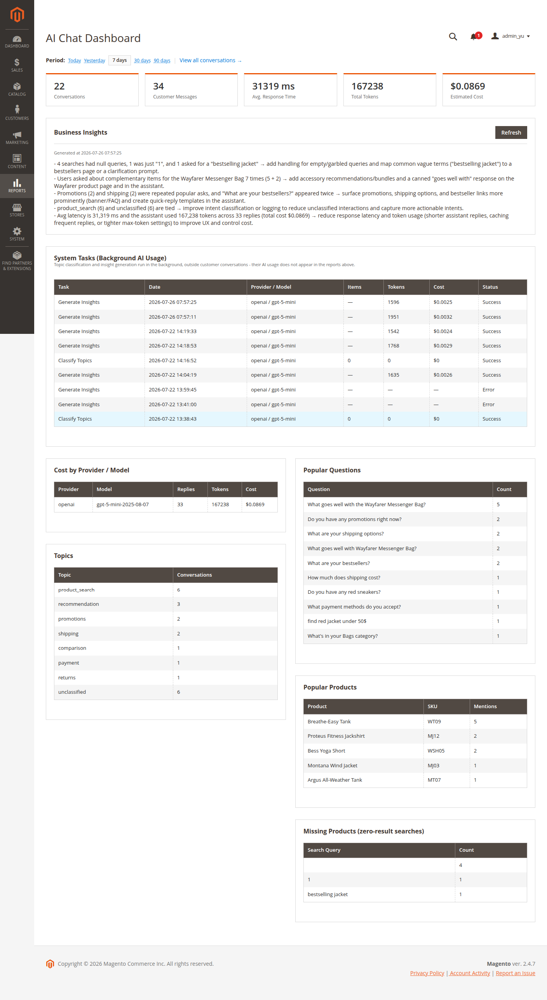
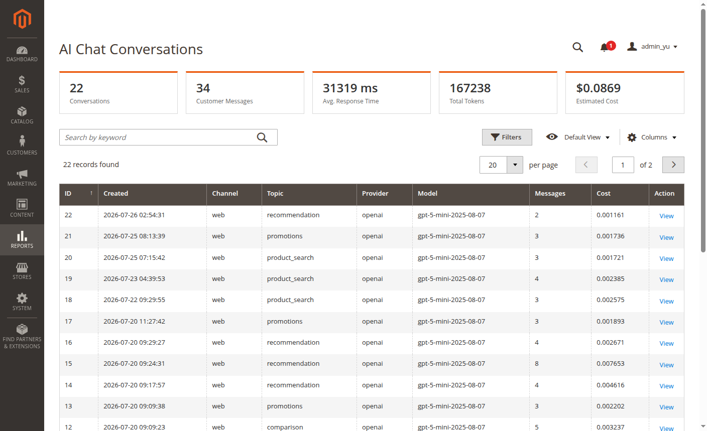

# Magento 2 AI Shopping Assistant — Chat, Product Search & Conversation Analytics

<a href="https://yu.net.ua/" target="_blank" rel="noopener noreferrer"></a>

**🔗 Demo: <a href="https://yu.net.ua/" target="_blank" rel="noopener noreferrer">yu.net.ua</a>**

A floating chat widget on your Magento 2 storefront: the customer searches
for products, compares them, and asks questions in plain language, and the
AI answers grounded in real catalog data — it doesn't make up an answer on
its own. Every conversation is stored and analyzed, so the merchant sees
what customers actually ask, which products they can't find, and what they
worry about most.


## What customers can do

- **Search products in plain language** — "something for my wife as a
  gift", "running shoes under $80", "a red dress in size 42" — the
  assistant searches the store's real catalog and answers with specific
  products, not generic phrases.
- **Compare and get recommendations** — "compare these two models",
  "what's better for a hiking trip", "show me something similar".
- **Ask about a specific product** — "is it waterproof?", "is it in
  stock in size 42?" — the assistant knows which page the customer is on
  and doesn't make them name the product again.
- **Ask about the store** — shipping, payment, returns, warranty,
  current promotions.
- **Context awareness** — the assistant automatically knows which page
  the customer is viewing (product, category) without requiring any
  manual input.

## What merchants get — conversation analytics



- **Admin dashboard**: number of conversations, number of messages,
  average response time, spend by LLM provider and model.
- **Topic classification** — every conversation is automatically tagged
  by topic (product search, comparison, shipping, payment, returns,
  etc.), so you can see what's asked about most.
- **Products customers couldn't find** — a list of queries the catalog
  had no results for: a signal for what to add to your assortment.
- **Popular questions and products** — what customers ask about and
  which products come up most often.
- **Business insights** — every week the AI analyzes the accumulated
  statistics on its own and writes up findings in plain language (for
  example: "customers frequently ask about a product that's out of
  stock" or "shipping questions increased this week").



## How it works

The widget is a lightweight floating chat on the storefront that works on
top of any Magento theme (plain HTML/CSS/JS — it doesn't conflict with
the theme or add weight to the page). The customer's message goes to the
server, and the assistant, when needed, calls into the store catalog
through search/comparison/recommendation tools (see `Yu_AiSearchEngine`)
— this keeps the model from "inventing" products or prices that don't
exist in the store. Every message — both the customer's question and the
assistant's answer — is stored along with tokens, cost, and response
time, which feeds the analytics.

The language model is served by a separate module, **Yu_AiLlm** — you can
choose OpenAI, Anthropic Claude, Google Gemini, xAI Grok, Gonka, and
others, with automatic failover to a backup provider if one goes down.

## Requirements

- PHP >= 8.1
- Magento 2.4.x with Elasticsearch/OpenSearch configured
- The `Yu_AiLlm` and `Yu_AiSearchEngine` modules (installed automatically
  as dependencies)
- An API key for at least one supported LLM provider

## Installation

```bash
composer require yu-dev/module-ai-chat
bin/magento module:enable Yu_AiLlm Yu_AiSearchEngine Yu_AiChat
bin/magento setup:upgrade
bin/magento setup:di:compile
bin/magento cache:flush
```

The module is installed disabled — the widget won't appear on the
storefront until you enable it in the admin panel and configure at least
one LLM provider.

## Configuration

**Stores → Configuration → AI → Chat AI**

- **General** — enable the module, widget position on the page.
- **Chat** — widget title, welcome message, example questions, system
  prompt (tone and style of answers), store facts (things the assistant
  should always know — e.g. shipping terms), color theme — 10 built-in
  color themes to choose from, plus the ability to create and save your
  own theme with custom colors.
- **Analytics** — enable topic classification, automatic business
  insights, conversation history retention period.
- **Product Search** — a fallback SQL-based search for when the search
  engine is unavailable.

The LLM provider is configured once, in **Stores → Configuration → AI
→ LLM AI** — this section belongs to the `Yu_AiLlm` module and is shared
across all AI modules on the store.

- **Shared Settings** — temperature (0–1: lower is more focused and
  predictable, higher is more creative; automatically scaled to each
  provider's own native range) and the maximum number of tokens per
  response.
- **Provider: OpenAI / Anthropic Claude / Google Gemini / xAI Grok /
  DeepSeek** — for each provider separately: enabled flag, failover
  priority (lower value = used earlier in the chain), API key (stored
  encrypted), model, input/output token price (used only for the cost
  estimate shown in analytics — update it manually whenever you change
  the model or rates change).
- **Provider: Gonka** — a decentralized GPU network with open-weight
  models (Kimi, MiniMax, Qwen); accessed through a broker — same fields
  as the other providers, plus the broker URL.
- **Provider: Custom (OpenAI-compatible)** — any service with an
  OpenAI-compatible chat completions API: OpenRouter, Groq, Together,
  Fireworks, a local Ollama instance, etc. — service URL, key, model.

Providers are tried in priority order: if the active provider fails, the
request automatically falls through to the next one.

## Author

Yuriy Akishin:
- 📧 Email: yuriy.akishin@gmail.com
- 💼 LinkedIn: https://www.linkedin.com/in/yuriyakishin/
- 💻 GitHub: https://github.com/yuriyakishin

## License

[MIT](LICENSE)
